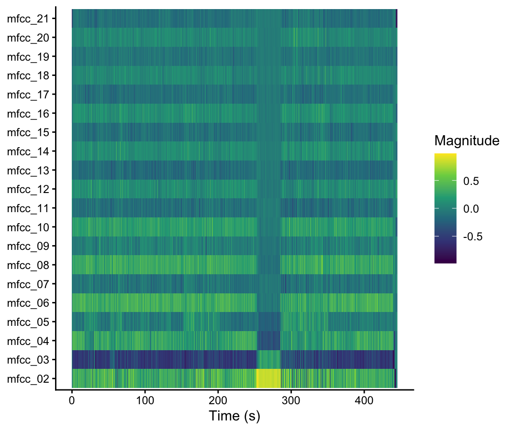
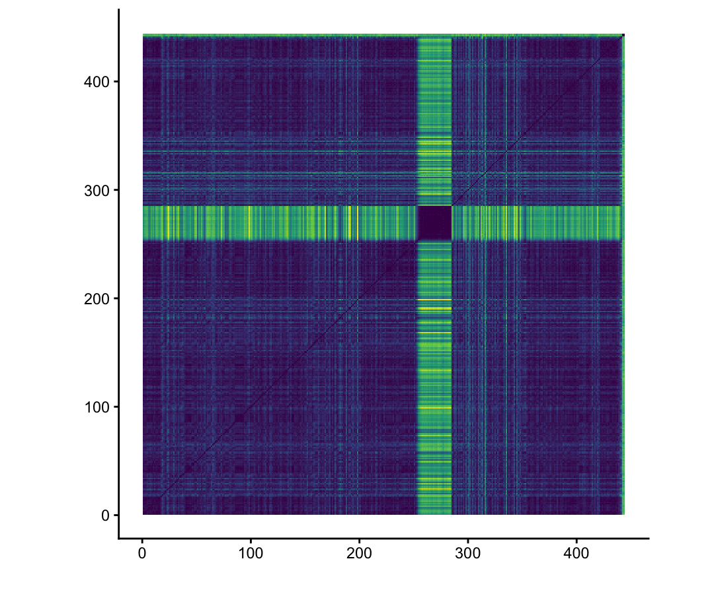

# homework-week-9
Submission of chromagrams and cepstrograms.
# Cepstrogram and Self-Similarity Matrix Analysis

## Song: [Bleed - Meshuggah (2008)] [Bleed - Meshuggah (2023 Remaster)]

### Cepstrograms

As you can see, the cepstrogram for the 2008 original recording of 'Bleed' by Meshuggah has a long instrumental section that ends just before the 300 second mark, causing a visible difference in timbre on the cepstrogram. This instrumental section uses less distortion than other areas within the piece and has a much softer sound, which comes across as extreme when contrasted with the high-distortion, intense guitar and percussion through the rest of the piece.

This cepstrogram for the 2023 remaster of 'Bleed' by Meshuggah is very similar to the cepstrogram of the original recording, though measurement of timbre in the instrumental section before the 300 second mark appears slightly more extreme here, highlighting an increase in the difference of timbre with the 2023 version's mixing. Both this and the previous cepstrogram use Euclidean normalisation rather than Manhattan or Chebyshev, as those methods of normalisation, I found, provided the best visual display of variance in timbre.

### Self-Similarity Matrix

I've also provided a self-similarity matrix for the 2023 remaster of 'Bleed', where the difference in timbre during the instrumental section is even more visible.
